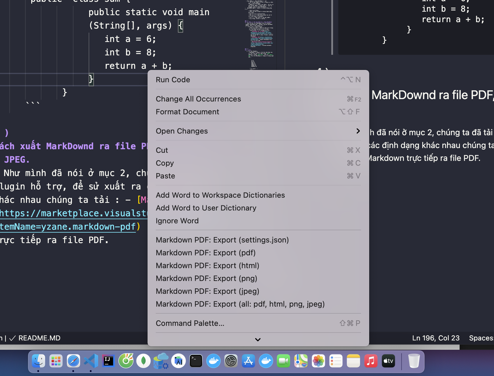
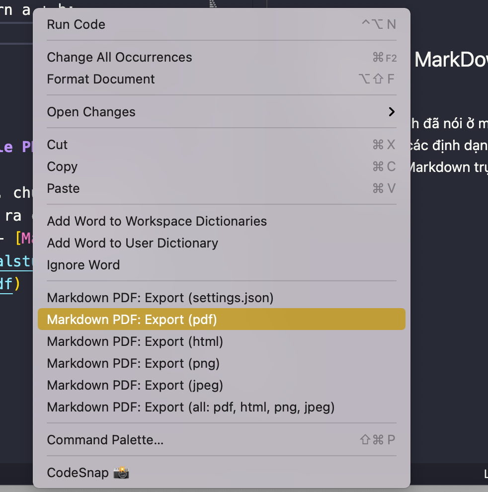
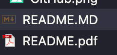
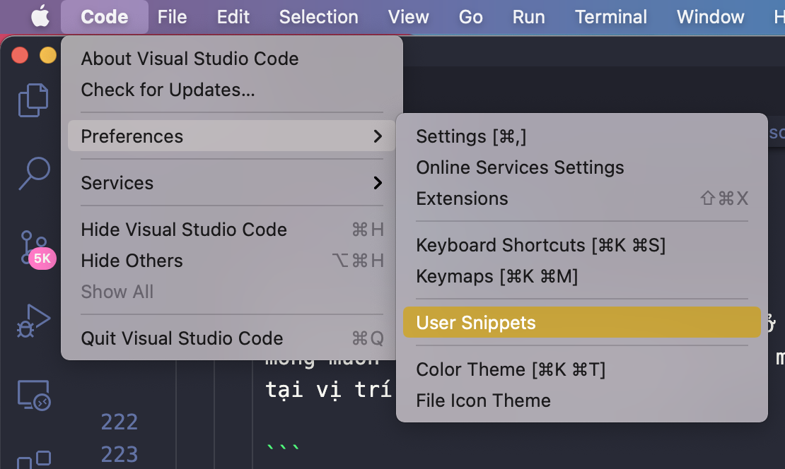
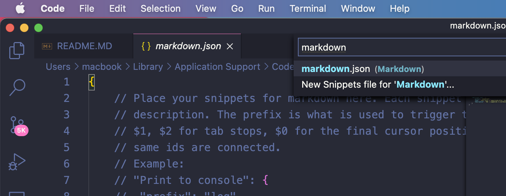
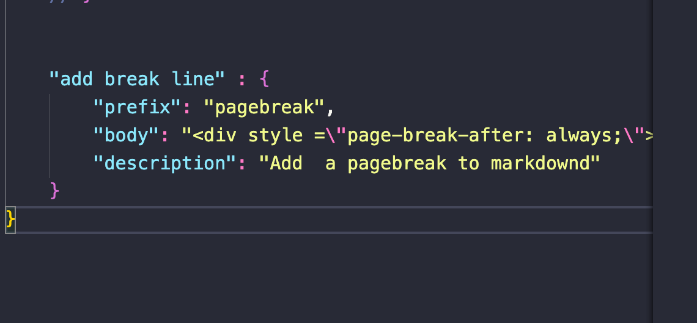
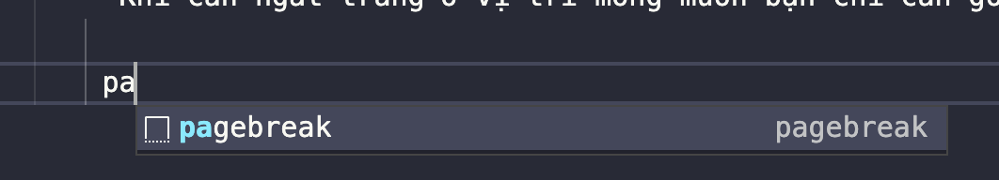

# Learn MarkDown.
## Nội dung.
  1. Giới thiệu về ngôn ngữ MarkDown.
  2. Các bước cơ bản ban đầu để sử dụng MarkDown.
  3. Cú pháp cơ bản của MarkDown.
  4. Cách xuất MarkDownd ra file PDF, HTML, Json, PNG, JPEG.
  5. Các nguồn tài liệu về MarkDown.
## 1 )  
## Markdown là gì?
 - *MarkDowd* là một ngôn ngữ đánh dấu. Thế ngôn ngữ đánh dấu là gì? Ngôn ngữ đánh dấu rất đơn giản là một cách để làm cho một vài đoạn văn bản có ý nghĩa khác với các đoạn khác. - Markdown đã được tạo ra vào năm 2004 bởi John Gruber với sự đóng góp đáng kể từ Aaron Swartz, với mục đích cho phép người sử dụng “dễ viết các định dạng văn bản đơn giản dễ đọc, và tùy chọn chuyển đổi nó thành các mã XHTML hợp lệ (hoặc HTML)”. Lấy cảm hứng từ các văn bản đơn giản trong email như setext, ngôn ngữ được thiết kế để có thể đọc như - là, không nhìn nó được đánh dấu với thẻ hoặc cú pháp định dạng, không giống như các văn bản đã được định dạng với một ngôn ngữ Markup , chẳng hạn như HTML, trong đó có thẻ rõ ràng và cú pháp định dạng. Markdown là một cú pháp định dạng cho văn bản có thể được đọc bởi con người và có thể dễ dàng chuyển đổi sang HTML. Gruber đã viết một văn bản Perl - “Markdown.pl”, nó là một văn bản khác đi với XHTML hay HTML bằng việc thay thế các cú pháp thẻ bằng những cú pháp dễ dàng hơn nhưng chức năng thì tương tự nhau. Nó có thể được sử dụng như là một văn bản độc lập, như là một plugin cho Blosxom hay Movable Type, hoặc như một bộ lọc văn bản cho BBEdit. Các phần mềm sử dụng ngôn ngữ Markdown: GitHub, GitBook, Reddit, Diaspora, Stack Overflow, OpenStreetMap và các ứng dụng khác. Tệp tin: Một tài liệu Markdown là một file văn bản với phần mở rộng là .md. Bạn có thể mở tệp tin markdown bằng một trình soạn thảo bất kỳ trên máy tính của bạn.
## Tại sao cần sử dụng Markdown
 - Đã là một lập trình viên thì bạn phải biết MarkDown. Nếu một ngày một đồng nghiệp bảo bạn hãy viết cho mình cái file README.MD  mô tả project để chia sẻ cho anh em trong công ty, nếu bạn không biết MarkDown thì có phải bạn lại cảm thấy khá ngại mặt đúng không nào? 
     
 - So sánh MarkDownd với HTML ->  HTML là một ngôn ngữ phổ biến,được sử dụng rộng rãi trong các ứng dụng sử dụng internet từ các trang web tới nội dung email hay rất nhiều các tài liệu hướng dẫn online cũng đều sử dụng ngôn ngữ này.
Tuy nhiên nhược điểm của nó là cú pháp của ngôn ngữ này không được thân thiện lắm với người dùng nếu không phải nói nó quá lằng nhằng và rắc rồi. Ví dụ như một khi bạn đã dùng thẻ p thì bạn sẽ phải đóng nó lại bằng thẻ p Với văn bản ngắn thì không sao nhưng nếu bạn phải viết văn bản hàng chục trang thì sao? Lại còn rất nhiều tính năng thừa thãi so với một writer nữa, có ai nhớ được tất cả các thẻ của HTML không? Thêm cả các thuộc tính riêng cho từng thẻ nữa?
Vì vậy đã có nhiều ngôn ngữ ra đời để thay thế HTML làm ngôn ngữ đánh dấu đơn giản tập trung vào nội dung cho writer. Trong số đó thì nổi bật nhất là Markdown, chủ yếu do nó được lựa chọn làm ngôn ngữ đánh dấu chính cho Github (hosting cho các dự án nguồn mở lớn nhất thế giới). Gần đây Markdown trở nên khá nổi tiếng trong giới làm web, những blogger và những người viết sách self-publishing nhờ tính đơn giản, gọn nhẹ, dễ học của nó. Một khi đã quen thì bạn hoàn toàn có thể dùng Markdown thay thế cho MS Word.

  - Đối tượng sử dụng MarkDown là ai? 
      - Tất cả mọi người có thể sử dụng nếu chịu học cú pháp MarkDown.
      - Nhưng chủ yếu theo mình thấy là đa số các anh em Dev dùng là nhiều nhất, và một số blogger cũng sử dụng MarkDownd.
-   MarkDown được sủ dụng vào những trường hợp nào ?
      - Chat trên Slack.
      - Soạn văn bản format ra nhiều định dạng khác nhau.
      - Hỏi bài trên stackoverflow.
      - Dev viết tài liệu cho project để mô tả các tính năng của product. 
      - Viết tài liệu chia sẻ cho mọi người.
      - Viết blog, slide bài giảng.... 

## 2 )
## Các bước cơ bản ban đầu để sử dụng MarkDown
 -  Bạn có thể viết MarkDown trên các editor support MarkDown như : VSCode, Online markdown editor, bất cứ text editor nào ...
 -  Ở đây mình sử dụng VScode.
       - Đầu tiên bạn Cài đặt VS code trên trang chủ tuỳ theo hệ điều hành của bạn.
       - Sau đó bạn cài các plugin hỗ trợ : 
          - [Markdown All in One](https://marketplace.visualstudio.com/items?itemName=yzhang.markdown-all-in-one) : Hỗ trợ gõ tắt cú pháp, format, preview Markdown.  
          - [Markdown PDF](https://marketplace.visualstudio.com/items?itemName=yzane.markdown-pdf) : Export Markdown trực tiếp ra file PDF.
          - [Markdown Preview Mermaid Support](https://marketplace.visualstudio.com/items?itemName=bierner.markdown-mermaid) : Preview mermaid diagrams.
     
## 3 )
## Cú pháp 
   1. Các thẻ Headers. 
      - MarkDown sử dụng kí tư # để bắt đầu cho các thẻ tiêu đề, nếu như trong `html` thường sử dụng `<h1></h1>` cho tới `<h6></h6>` thì đây MarkDown sử dụng các dòng lệnh như : 
  
        ```
           # h1
           ## h2
           ### h3
           #### h4
           ##### h5
           ###### h6
        ```
        - Kết quả là : 
         # h1
         ## h2
         ### h3
         #### h4
         ##### h5
         ###### h6 
    
   1. Trình bày theo  List
       - Sử dụng kí tự * hoặc - đầu mỗi nội dung cần hiển thị 
 
          ```  
         - item 1
         - item 2
         - item 3

         * item 1
         * item 2
         * item 3
          
         ```

            - Kết quả : 
             
         - item 1
         - item 2
         - item 3

         * item 1
         * item 2
         * item 3    


   1. Trình bày danh sách có sắp xếp
      - Ở đây chúng ta có thể tự đánh dấu thứ tự bằng cách : 
       
        ```
         1. Nội dung 1.
         2. Nội dung 2.
         3. Nội dung 3.
        ```    
        * Kết quả :
             1. Nội dung 1.
             2. Nội dung 2.
             3. Nội dung 3. 


      - Hoặc chúng ta muốn thay đổi nội dung và thứ tự giữa các dòng, thì ta có thể sử dụng cách 2 để dễ dàng hơn :
   
    
        ```
              1. Nội dung 1
              1. Nội dung 2
              1. Nội dung 3
        ```
      - Kết quả : 
         1. Nội dung 1
         1. Nội dung 2
         1. Nội dung 3

         
  1. Chèn Images
     - Để insert Images ta thực hiện cấu như sau : 

       ```
        

        Cụ thể 
       ```   
 
     - Ví dụ : 

       ```
          
       ```  
     - Kết quả : 
      
         

   
   1. Chèn Links 

      - Để thực hiện insert một liên kết ta sử dụng cú pháp như sau :

       ```
        [Tên links](links)
       ```   
      - Ví dụ : 
       
       ```
        [Facebook : Nguyễn Đức Thông](https://www. facebook.com/1824ttd)
       ```
      - Kết quả :
         
        [Facebook: Nguyễn Đức Thông](https://www.facebook.com/1824ttd) 
 
   1. Ký tự in đậm, in nghiêng
      
      - Để in đậm một đoạn text bạn chỉ cần làm như sau:
      ```
        **từ cần in đậm**
      ``` 
      - Kết quả :
       **từ cần in đậm** 
      - Để in nghiên một đoạn text bạn chỉ cần làm như sau: 
      ```
        *từ cần in nghiêng*
      ``` 
      - Kết quả : 

        *từ cần in nghiêng* 

   1.  Trích dẫn, bo chữ
    
       -  Ví dụ khi bạn soạn tài liệu dự án cho anh em trong công ty, khi có một từ khoá trong tài liệu, bạn muốn làm nổi bật nó, thì làm như sau :
          
        ```
          `Array` là một loại cấu trúc dữ liệu kiểu mảng. 
        ``` 

       - Kết quả:  
           `Array` là một loại cấu trúc dữ liệu kiểu mảng. 

       - Hoặc bạn muốn đưa source code của mình lên các diễn đàn, group, slack, stackoverflow hỏi, thì bạn có thể sử dụng cú pháp sau để format code trông gọn gàng clear code hơn.

        ```
          Cú pháp ````
                   public  class sum {
                     public static void main (String[], args) {
                        int a = 6;
                        int b = 8;
                        return a + b;
                     }
                   }

                  ````
        ``` 
        - Kết quả : 

         ```
          public  class sum {
                     public static void main (String[], args) {
                        int a = 6;
                        int b = 8;
                        return a + b;
                     }
                }
         ``` 

## 4 )
## Cách xuất MarkDownd ra file PDF, HTML, Json, PNG, JPEG.
   - Như mình đã nói ở mục 2, chúng ta đã tải các plugin hỗ trợ, để sử xuất ra các định dạng khác nhau chúng ta tải : - [Markdown PDF](https://marketplace.visualstudio.com/items?itemName=yzane.markdown-pdf) : Export Markdown trực tiếp ra file PDF.
    - Đầu tiên chúng ta click chuột phải bất kì trên màn hình :

       
   
   - Sau đó chọn các định dạng mà bạn muốn xuất, ở đây mình xuất ra file pdf nên mình chọn Markdown PDF : Export (pdf).


        

   - Và kết quả mình đã export ra đươc file PDF để chia sẻ cho anh em trong công ty. 


   
         

   - NOTE !!!!
       - Khi xuất file pdf mà muốn ngắt trang ở vị trí mong muốn thì các bạn thêm dòng này vào markdown, tại vị trí mà bạn muốn ngắt trang.

       ```
         <div style="page-break-after: always;"></div>
       ``` 
       - Bạn có thể tạo một user-snippet, để tiện sử dụng về sau:
         - Vào File --> Preferences --> User snippets

          

      - Sau đó : 

       

      - Và chọn markdown.json , thêm đoạn scrip này vào : 

        

      - Khi cần ngắt trang ở vị trí mong muốn bạn chỉ cần gõ pagebreak thì hệ thống gợi ý sẽ gợi ý đoạn thẻ body ra cho bạn. 

       


         
## 5 )
## Các nguồn tài liệu
   
   -  Các bạn có thể truy cập : [Markdown](https://guides.github.com/pdfs/markdown-cheatsheet-online.pdf).
 

##### NOTE
- Bản quyền thuộc về : Coding Dev (Nguyễn Đức Thông) .  